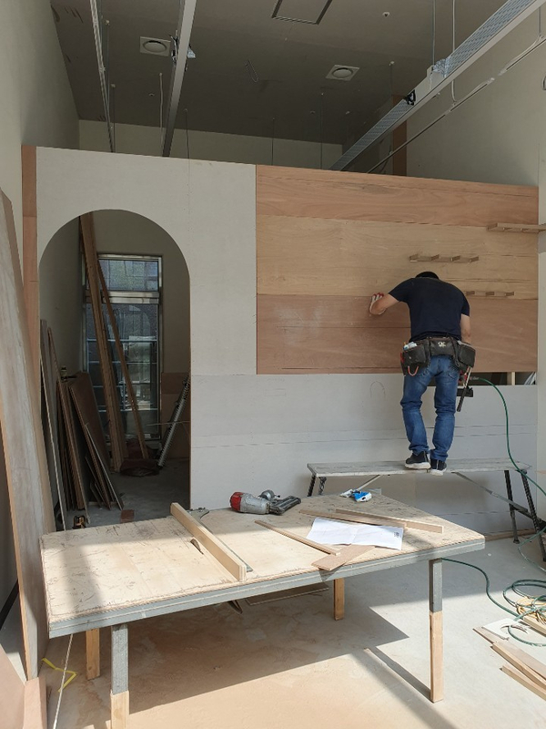
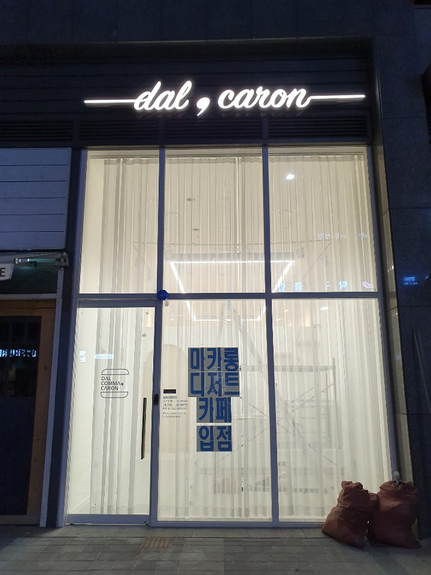

### 높은 층고를 살린 디자인

친한 지인이 마카롱 가게를 준비하는 과정에서 전체적인 인테리어 컨설팅을 맡아서 진행했습니다.
상가를 처음 들어왔을시 복층구조를 목적으로 층고가 6M로 구성되어 있던 상가였습니다.
복층 구조로 하게되면 금액적인 부분이 많이 증가가 되어 높은 층고를 살린 디자인을 제안하였습니다.

천정에 라인펜던트조명을 제작하여 설치를하여 높은 층고를 이용한 깊게 파고드는 조명을 연출하였습니다.
외부에서 보았을때는 내부 마카롱 가게가 웅장하게 보이는 효과도 있으며, 내부에서 보았을때는 매장이 조금 더 넓어보이는 효과를 연출하였습니다.

내부 가벽은 목구조틀로 제작을 하였고, 선반 등 보강이 필요한 위치에는 합판으로 보강을 잡아주었습니다.
추후에 합판보강이 없으면, 벽에 고정하는 구조물들이 힘이 없어 하자에 대상이 됩니다. ㅜㅜ

타일은 600\*600 풀바디 포세린타일을 이용하였고,
연그레이 타일을 이용하여 전체적인 화이트 느낌에서 무게를 주어 차분하게 연출하였습니다.
부자재는 드라이픽스를 이용하여 접착력을 우수하게 시공하였고,
메지는 아덱스 제품의 메지를 이용하여 퀄리티를 조금 더 업시켰습니다!

도장은 벤자민무어 제품으로 작업 후 칠냄새가 많이 나지않으며,
추후 오염이 되었을떄 물로도쉽게 지울수 있는 제품을 사용하였습니다!

