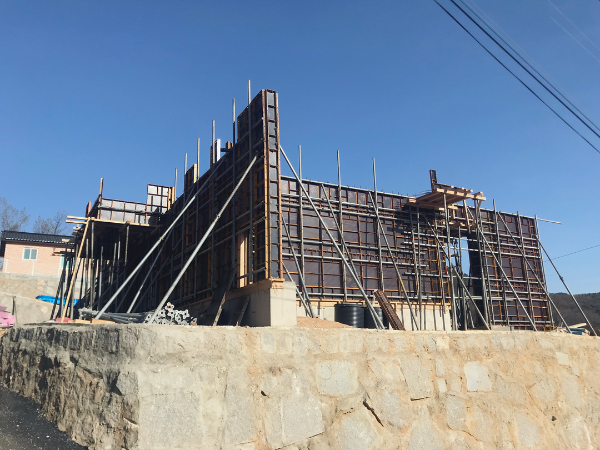

### 노출 콘크리트 전원 주택

2018년 제일 기억에 남는 프로젝트를 뽑으라고 한다면 3월달 부터 9월달 까지 공사했던 전원주택이 생각이 가장 생각이듭니다. 보통 외관 전체를 노출콘크리트로 시공하는곳은 근린생활시설(상가, 카페 등)을 주로 공사를 하지만 이번 전원주택은 외관 전체를 노출콘크리트 마감으로 진행하였습니다.

노출콘크리트 공사가 처음이라 공부도 많이 되었던 현장이였습니다.

일단 일반적은 철근 콘크리트 건물은 외장재라는 마감재가 붙기에 일반적으로 유로폼이 터지거나 빈골재가 발생이 되어도 공사 진행하는것에 큰문제가 없지만 콘크리트 자체가 마감이기에 콘크리트 배부름현상, 충분한 진동 다짐이 진행이 안되어 빈 골재들이 발생되게 되면 보수 보기가 까다롭다는 점에 많은 형틀 목수들이 힘들어 하는 구조물입니다.

콘크리트 면을 잘 뽑았다고 하여도, 레미콘의 상태, 철근배근의 상태에 따라 추 후 크랙이 발생될 수도 있는 부분이있어, 철근 배근시에도 피복을 정확히 유지를하며, 레미콘 품질 및 강도, 레미콘 다짐시 충분한 다짐을 해야 하자에대해 방지 할수 있습니다.

전원주택에서 가장 중요한 단열부분도 빼놓을 수가 없습니다. 본 건물은 벽체는 압출법 1급 120T 천정은 압출법 1급 220T를 시공을 하였으며, 일반적인 건축물은 외단열이지만 노출콘크리트는 내단열로 진행을 해야함으로써 기밀성 또한 많이 요구됩니다. 벽체 'ㄱ'코너부분이나 벽과 천정과 만나는 단열재 부분 등 단열을 꼼꼼히 진행하지 않으면 추 후 곰팡이, 결로 등.. 다양한 문제점이 있어 현장에서 꼭! 단열재, 콘크리트품질, 타설시 충분한 다짐 3가지는 중요하게 확인을 해야합니다.

노출콘크리트로 건축물을 시공하시려는 예비 건축주분들께서는 시공회사와 충분한 미팅으로 제대로 된 건설회사와 진행하는것을 추천드립니다. 또한 같은 노출콘크리트 이지만 다양한 칼라감과 질감을 표현할수 있기에 충분한 미팅이 꼭 필요합니다!
