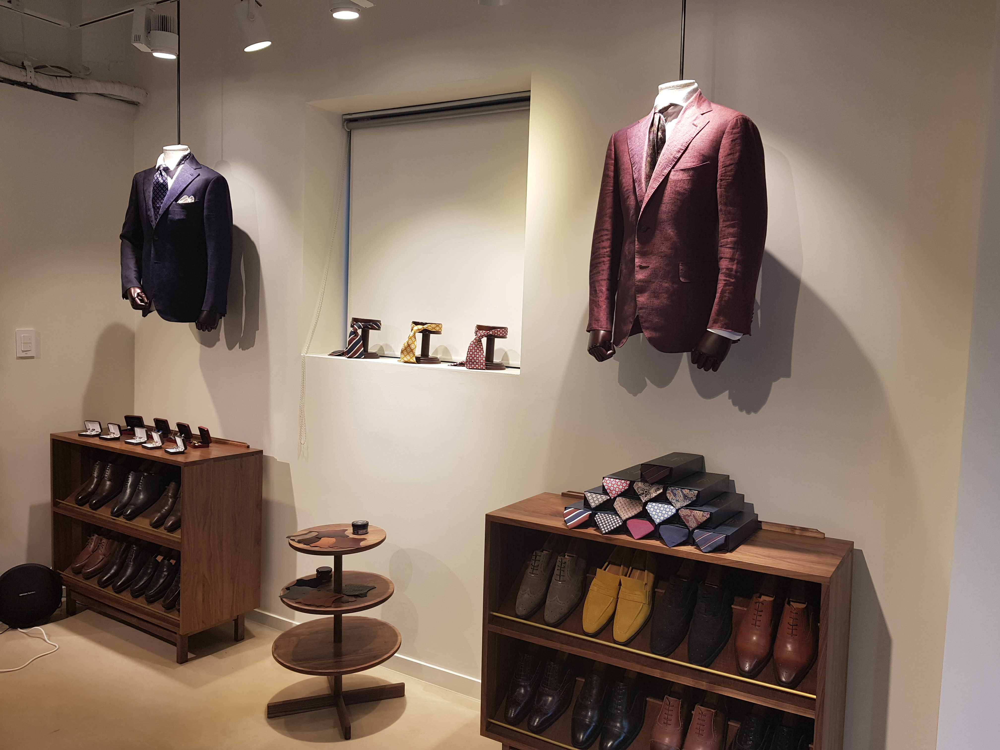

오늘은 파리스토 강남점 프로젝트를 소개해드릴려고합니다.
맞춤정장 가게로 이번에 맞춤정장, 기성복을 같이 런칭하게되면서
삼성동으로 이사롤 하게 되셨다고 합니다!
맞춤정장이라고 하면, 벽돌, 우드 느낌이 강한 느낌이지만
약 8년정도 빨간벽돌들과 같이 지내오신 대표님꼐서
다른 느낌의 분위기를 원하셨습니다!
소개해 드리겠습니다!

공사 하기 전 매장 사진입니다.
매장에 기존시설이 어느정도 갖추어 져있어 기존시설을 최대한 살리는 느낌으로
새롭게 인테리어를 진행했습니다!

공사 착공 전 밤낮없이 미팅하는 모습입니다.
공사 착공 전 여러차례 현장미팅을 통해 클라이언트분의 이야기를 최대한 많이 담았습니다!

목공사로 철거한 파티션 부분에 가벽을 쳐주었습니다.
또한 기존에 쓰시던 냉장고에 맞추어 가구를 현장에서 제작을 해드렸구요,
마지막으로 피팅룸 단상과 벽선반도 제작해 드렸습니다.

​파리스토 로고를 이용하여 외부 벽면과 매장내부에 사인물을 부착했습니다.

공사가 완료되고 난 이후 훨씬 깔끔해진 매장 전경입니다.

​

마지막으로 파리스토 매장의 하이라이트 원목가구 입니다!
기존 매장에 마감재를 최대한 사용하여 비용을 최소화하고,
추후에 매장을 이사를 가더라도 가져갈수 있도록 이동식 집기를 원목으로 제작하였습니다!
가구 사진에 들어있는 마감하나하나 섬세하게 디테일을 집어넣어
맞춤양복의 섬세함을 표현하였습니다!

​
또한 기존조명은 원통형 일반형 레일조명에서
COB라는 레일등으로 바꾸어주어 매장이 한층 더 밝아지고,
소품, 의류 등을 조명을 쏴주어 포인트가 될수 있도록 조명을 변경하였습니다!

​

기존에 시설을 최대한 이용한다는것은 사실상 일하는 사람 입장으로서는 힘든 부분이 많습니다.
아무래도, 기존에 공사가 되어있던것들이 공사가 제대로 이루어 지지 않은것들도 많고,
세월이 지나다보면 조금 씩 하자가 생기기도마련입니다.
